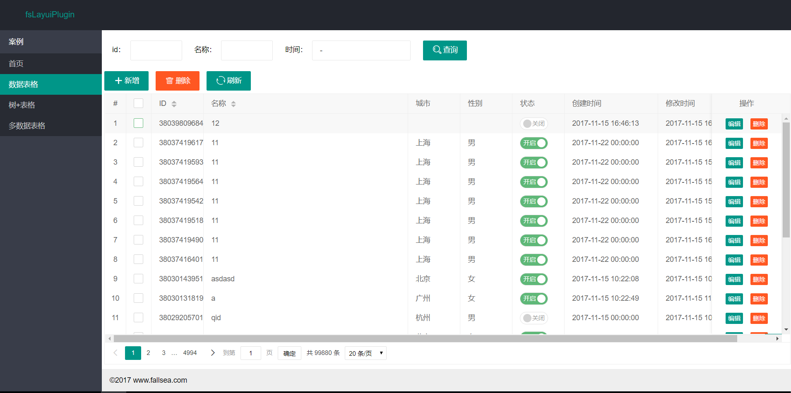

# fsLayuiPlugin

> **fsLayuiPlugin** 是一个基于layui的快速开发插件，支持数据表格增删改查操作，提供通用的组件，通过配置html实现数据请求，减少前端js重复开发的工作。  
> [GitHub下载](https://github.com/fallsea/fsLayuiPlugin) [开源中国下载](https://gitee.com/fallsea/fsLayuiPlugin)  
> 演示环境 [http://fslayuiplugin.fallsea.com](http://fslayuiplugin.fallsea.com)  
> [版本更新说明](https://github.com/fallsea/fsLayuiPlugin/releases)

## 操作说明

[1.fsLayuiPlugin介绍](http://www.itcto.cn/2017/11/11/layui/fsLayuiPlugin%E4%BB%8B%E7%BB%8D/)  

[2.fsLayuiPlugin配置说明](http://www.itcto.cn/2017/11/12/layui/fsLayuiPlugin%E9%85%8D%E7%BD%AE%E8%AF%B4%E6%98%8E/)  

[3.fsLayuiPlugin数据表格使用](http://www.itcto.cn/2017/11/12/layui/fsLayuiPlugin%E6%95%B0%E6%8D%AE%E8%A1%A8%E6%A0%BC%E4%BD%BF%E7%94%A8/)  

[4.fsLayuiPlugin数据表格弹出form表单说明](http://www.itcto.cn/2017/11/12/layui/fsLayuiPlugin%E6%95%B0%E6%8D%AE%E8%A1%A8%E6%A0%BC%E5%BC%B9%E5%87%BAform%E8%A1%A8%E5%8D%95%E8%AF%B4%E6%98%8E/)  

## 为什么要使用fsLayuiPlugin？

> 传统的开发一般需要实现增删改查功能，每个功能都需要对应一个html页面和js绑定操作。  
> 每个操作都需要绑定事件操作，那么每个页面都需要javascript代码来实现，对于一般业务不是特别强的后台系统来说，每个页面展示基本差不多，只是请求的url地址不一致。


### 新增demo

```html
<form class="layui-form" action="">
  <div class="layui-form-item">
    <label class="layui-form-label">输入框</label>
    <div class="layui-input-block">
      <input type="text" name="title" required  lay-verify="required" placeholder="请输入标题" autocomplete="off" class="layui-input">
    </div>
  </div>
  <div class="layui-form-item">
    <label class="layui-form-label">密码框</label>
    <div class="layui-input-inline">
      <input type="password" name="password" required lay-verify="required" placeholder="请输入密码" autocomplete="off" class="layui-input">
    </div>
    <div class="layui-form-mid layui-word-aux">辅助文字</div>
  </div>
  <div class="layui-form-item">
    <label class="layui-form-label">选择框</label>
    <div class="layui-input-block">
      <select name="city" lay-verify="required">
        <option value=""></option>
        <option value="0">北京</option>
        <option value="1">上海</option>
        <option value="2">广州</option>
        <option value="3">深圳</option>
        <option value="4">杭州</option>
      </select>
    </div>
  </div>
  <div class="layui-form-item">
    <label class="layui-form-label">复选框</label>
    <div class="layui-input-block">
      <input type="checkbox" name="like[write]" title="写作">
      <input type="checkbox" name="like[read]" title="阅读" checked>
      <input type="checkbox" name="like[dai]" title="发呆">
    </div>
  </div>
  <div class="layui-form-item">
    <label class="layui-form-label">开关</label>
    <div class="layui-input-block">
      <input type="checkbox" name="switch" lay-skin="switch">
    </div>
  </div>
  <div class="layui-form-item">
    <label class="layui-form-label">单选框</label>
    <div class="layui-input-block">
      <input type="radio" name="sex" value="男" title="男">
      <input type="radio" name="sex" value="女" title="女" checked>
    </div>
  </div>
  <div class="layui-form-item layui-form-text">
    <label class="layui-form-label">文本域</label>
    <div class="layui-input-block">
      <textarea name="desc" placeholder="请输入内容" class="layui-textarea"></textarea>
    </div>
  </div>
  <div class="layui-form-item">
    <div class="layui-input-block">
      <button class="layui-btn" lay-submit lay-filter="formDemo">立即提交</button>
      <button type="reset" class="layui-btn layui-btn-primary">重置</button>
    </div>
  </div>
</form>
```

```javascript
layui.use('form', function(){
  var form = layui.form;
  
  //监听提交
  form.on('submit(formDemo)', function(data){
    layer.msg(JSON.stringify(data.field));
    return false;
  });
});
```
## fsLayuiPlugin解决的问题？

> 通过引入**fsLayuiPlugin** js文件，快速开发datagrid增删该查操作。  

* 数据表格的增删改查
* 树+数据表格（树基于ztree实现，点击左边树，刷新表格数据）
* 多数据表格操作

### 新增demo
```html
<!DOCTYPE html>
<html>
<head>
  <meta content="text/html;charset=UTF-8"/>
  <title>fsLayuiPlugin</title>
  <meta name="keywords" content="fsLayuiPlugin,layui,layuiPlugin,layui插件" />
  <meta name="description" content="fsLayuiPlugin,layui,layuiPlugin,layui插件" />
  <meta http-equiv="X-UA-Compatible" content="IE=edge,chrome=1"/>
  <meta name="viewport" content="width=device-width, initial-scale=1, maximum-scale=1"/>
  <meta name="apple-mobile-web-app-status-bar-style" content="black"/>
  <meta name="apple-mobile-web-app-capable" content="yes"/>
  <meta name="format-detection" content="telephone=no"/>
  <meta name="refreshTable" content="0"/>
  <link rel="stylesheet" type="text/css" href="/plugins/layui/css/layui.css" media="all"/>
  <link rel="stylesheet" type="text/css" href="/css/fs.css" media="all"/>
  <script type="text/javascript" src="/plugins/layui/layui.js"></script>
  <script type="text/javascript" src="/plugins/jquery/jquery.min.js"></script>
  <script type="text/javascript" src="/plugins/jquery/lodash.min.js"></script>
  <script type="text/javascript" src="/plugins/jquery/jquery.formautofill.js"></script>

  <link rel="stylesheet" href="/plugins/ztree/css/zTreeStyle/zTreeStyle.css" type="text/css"/>
  <script type="text/javascript" src="/plugins/ztree/js/jquery.ztree.all.min.js"></script>

  <script type="text/javascript" src="/plugins/frame/js/fs.js"></script>
  
  <script type="text/javascript" src="/plugins/frame/js/frame.js"></script>
</head>
<body class="layui-layout-body">
  <div class="layui-fluid">
  <form class="layui-form">
    <div class="layui-form-item">
      <label class="layui-form-label">名称</label>
      <div class="layui-input-block">
        <input type="text" name="name" required=""  lay-verify="required" placeholder="请输入名称" autocomplete="off" class="layui-input"/>
      </div>
    </div>
     <div class="layui-form-item">
      <label class="layui-form-label">城市</label>
      <div class="layui-input-block">
        <select name="city" lay-verify="required">
          <option value=""></option>
          <option value="0">北京</option>
          <option value="1">上海</option>
          <option value="2">广州</option>
          <option value="3">深圳</option>
          <option value="4">杭州</option>
        </select>
      </div>
    </div>
    <div class="layui-form-item">
      <label class="layui-form-label">类型</label>
      <div class="layui-input-block">
        <input type="checkbox" name="type" title="写作" value="write">
        <input type="checkbox" name="type" title="阅读" value="read">
        <input type="checkbox" name="type" title="发呆" value="dai">
      </div>
    </div>
    <div class="layui-form-item">
      <label class="layui-form-label">性别</label>
      <div class="layui-input-inline">
        <input type="radio" name="sex" value="男" title="男" checked="checked">
        <input type="radio" name="sex" value="女" title="女">
      </div>
       <label class="layui-form-label">状态</label>
      <div class="layui-input-inline">
        <input type="checkbox" name="state" lay-skin="switch" lay-text="开启|关闭" value="1" checked>
      </div>
    </div>
    <div class="layui-form-item layui-form-text">
      <label class="layui-form-label">创建时间</label>
      <div class="layui-input-inline">
        <input type="text" id="createdTime" name="createdTime" autocomplete="off" class="layui-input fsDate" dateType="datetime" />
      </div>
    </div>
    <div class="layui-form-item layui-form-text">
      <label class="layui-form-label">描述</label>
      <div class="layui-input-block">
        <textarea name="description" placeholder="请输入描述" class="layui-textarea"></textarea>
      </div>
    </div>
    <hr/>
    <div class="layui-form-item">
      <div class="layui-input-block">
        <button class="layui-btn" lay-submit="" lay-filter="save" url="/fsbus/1001">新增</button>
        <button type="button" class="layui-btn layui-btn-primary" function="close">关闭</button>
      </div>
    </div>
  </form>
  </div>
</body>
</html>

```

### 效果图




