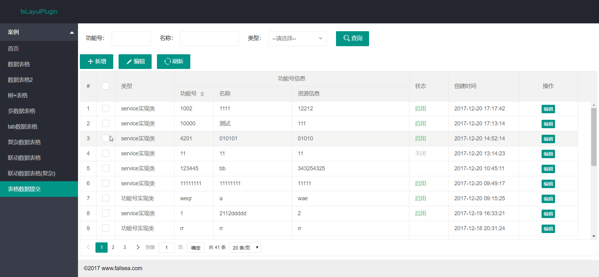
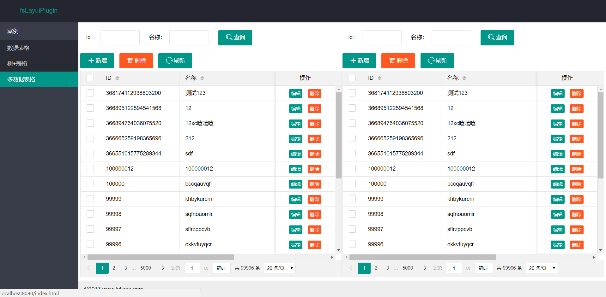

# fsLayui

> **fsLayui** 是一个基于layui的快速开发插件，支持数据表格增删改查操作，提供通用的组件，通过配置html实现数据请求，减少前端js重复开发的工作。目前支持单数据表格、多数据表格、tab数据表格、树+数据表格、联动数据表格、layeidt编辑器、下拉框联动、数据字典功能、表格编辑和提交等。  
qq交流群：**24017956** [点击链接加入群](https://jq.qq.com/?_wv=1027&k=5uImi0a)  
> [GitHub下载](https://github.com/fallsea/fsLayuiPlugin)   
[码云下载](https://gitee.com/fallsea/fsLayuiPlugin)  
> **演示环境** [http://fslayui.fallsea.com](http://fslayui.fallsea.com) ***最好先清空缓存***  
> [版本更新说明](https://github.com/fallsea/fsLayui/releases)  

`如果你觉得对你有所帮助，请Star关注一下，在使用过程中，先看下使用说明文档，谢谢。`

[我要点赞](http://fly.layui.com/case/u/1154664)

## 支持功能

* 简单数据表格增删改查
* 树+数据表格（树基于ztree实现，点击左边树，刷新右边表格数据）
* 多数据表格(同一页面多个数据表格操作)
* tab表格(tab切换表格)
* 复杂表格增删改查
* 联动表格增删改查
* 联动下拉框(省市区级联等)
* 数据表格转义(例如：表格某个字段需要需要把代码填充中文名称)
* 文件上传功能
* layedit编辑器
* 数据字典功能
* 表格编辑和提交
* 菜单导航栏
* 表格服务端排序

## 使用插件的好处？

> 可以更简洁高效的开发一个功能，通过配置一些标签，自动实现异步请求或事件处理。减少重复开发的工作量，提高工作效率。

## 使用说明

[API文档](http://www.itcto.cn/docs/fslayui)

## 版本号规范

> [语义化版本2.0.0](http://www.itcto.cn/news/%E8%AF%AD%E4%B9%89%E5%8C%96%E7%89%88%E6%9C%AC2/)

## 效果图

## 贡献者

* JsonBy

## 捐赠

项目的发展离不开你的支持，请作者喝杯咖啡吧！

## License

MIT License

Copyright (c) 2017 fallsea
